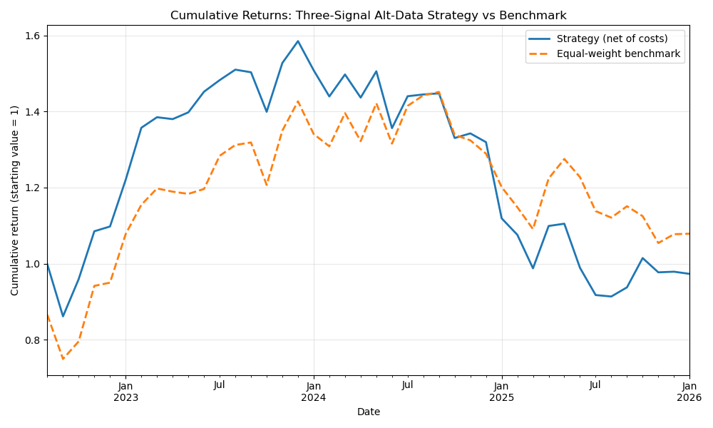

# UK Consumer Alt-Data Strategy

A systematic long-only equity strategy on UK consumer stocks, using alternative data (Google Trends search volume and UK port freight statistics) to generate monthly signals. Personal project.

## At a glance

- **7 UK consumer stocks**, monthly rebalancing, long-only top-3
- **Two alternative data sources**: Google Trends search interest + DfT port freight statistics
- **42-month backtest** with 20bp monthly transaction cost
- **Result**: Sharpe 0.14 (net) vs 0.21 for equal-weight benchmark - strategy underperformed. Full analysis and honest limitations below.

## Hypothesis

Consumer stock returns should be predictable, in part, from two publicly observable inputs:

1. **Consumer attention** - if search interest in a brand is unusually high vs its recent history, this may lead its share price.
2. **UK import activity** - if UK inbound container tonnage is unusually high, this may signal broader consumer demand strength that helps import-exposed retailers.

The strategy tests whether combining these two signals into a composite score, and holding the top-ranked stocks monthly, beats a naive equal-weight benchmark across the same universe.

## Universe

Seven FTSE-listed UK consumer stocks, chosen for meaningful UK brand recognition (so Google Trends data has signal) and mix of sub-sector exposure:

| Ticker | Company | Sub-sector |
|---|---|---|
| GRG.L | Greggs | Food-to-go |
| NXT.L | Next | Apparel & home |
| JD.L | JD Sports | Sportswear |
| DOM.L | Domino's Pizza UK | Restaurant delivery |
| JDW.L | JD Wetherspoon | Pubs |
| BME.L | B&M European | Discount retail |
| MKS.L | Marks & Spencer | Food & clothing |

## Data sources

- **Prices:** yfinance, 5 years of daily data, resampled to month-end.
- **Google Trends:** manually exported CSVs (`trends.google.com`) covering the past five years, UK region, brand-name search terms. Data is monthly frequency due to Google's default aggregation for multi-year queries.
- **UK port freight:** DfT PORT0502 quarterly statistics (`gov.uk` open data). Inbound tonnage across five container-heavy UK ports (Felixstowe, London, Southampton, Grimsby & Immingham, Liverpool), forward-filled to monthly frequency to reflect the ~10 week publication lag.

## Method

1. Load and clean each data source into `data/processed/`.
2. Combine into a single monthly dataset (`master_dataset.csv`).
3. For each stock, compute a 12-month rolling z-score of Google Trends search interest.
4. Compute a 12-month rolling z-score of total UK container port inbound tonnage (macro signal, same for all stocks).
5. Take the equal-weighted average of the two z-scores as the composite score.
6. Each month, hold the top three stocks by composite score, equal-weighted. Rebalance monthly at month-end.
7. Apply a 20bp transaction cost per month as a rough allowance for rebalancing turnover.
8. Compare against an equal-weight buy-and-hold benchmark across the same universe.

## Results

Sample period: September 2022 to January 2026 (42 months after the 12-month burn-in for rolling signals).

| Metric | Strategy (net) | Equal-weight benchmark |
|---|---|---|
| Annualised return | 0.43% | 2.19% |
| Annualised volatility | 25.31% | 24.34% |
| Sharpe ratio | 0.14 | 0.21 |
| Maximum drawdown | -44.9% | -27.4% |
| Hit rate (positive months) | 54.8% | 52.4% |

**The strategy underperformed the equal-weight benchmark.** It outperformed from inception through January 2024, then lagged persistently. Higher hit rate but worse average outcomes suggests the wins were small and the losses were large.



*Cumulative returns: strategy (solid line) versus equal-weight benchmark (dashed). The strategy outperformed from inception through January 2024, then persistently lagged as the signals decoupled from returns.*

## Interpretation

Three candidate explanations for why the strategy stopped working in early 2024:

1. **Regime change.** Late 2023 saw a pivot in UK rate expectations. Macro-driven signals like port freight may have decoupled from consumer stock returns as investor focus shifted from cyclical fundamentals to rates sensitivity.
2. **Signal degradation.** Google Trends attention has become noisier as brand search saturates. A rolling z-score picks up mean reversion that fails when the underlying attention regime shifts.
3. **Small-universe volatility.** With only 7 stocks and 3 held at a time, one poor selection dominates the portfolio. The strategy is very sensitive to any single-stock idiosyncratic tail.

## Limitations

- **Sample size.** 42 months is small. Confidence intervals on Sharpe ratio are wide - the point estimate should not be treated as precise.
- **Trends frequency.** Google Trends returned monthly data for the multi-year query. Weekly-frequency Trends data (achievable with rolling shorter queries stitched together) would materially increase sample size.
- **Port freight is macro-uniform.** The same value applies to all stocks, so it doesn't help select between them - it only tilts the whole portfolio in or out.
- **Universe is small and UK-focused.** Extending to a broader FTSE 250 consumer basket would improve statistical power.
- **Transaction costs are a rough approximation.** A production version would model bid-ask spreads, stamp duty, and slippage per trade rather than a flat monthly haircut.
- **Backtest is not live.** No paper trading has been run; results are historical simulation only.

## Extensions

- Weekly Google Trends via rolling shorter queries, stitched together
- Add a third stock-specific signal (e.g. LinkedIn hiring rates by company)
- Long-short version with market-neutral construction
- Broader universe (FTSE 250 consumer names)

## How to run

Requirements: Python 3.11+ and the libraries listed in `requirements.txt`.

```bash
pip install -r requirements.txt
python src/pull_prices.py       # pull yfinance price data
python src/load_trends.py       # load manually exported Trends CSVs
python src/load_port_data.py    # load DfT port freight ODS file
python src/build_dataset.py     # combine into master monthly dataset
python src/backtest.py          # run backtest, produce chart and CSV
```

Google Trends CSVs must be manually downloaded from `trends.google.com` (5-year queries, UK region) and placed in `data/raw/` as `[ticker]_trends.csv`.

DfT port freight ODS must be downloaded from `gov.uk` (PORT0502 quarterly data) and placed as `data/raw/port0502.ods`.

## Repository structure


## Disclaimer

This project is for educational purposes and personal skill development. It is not investment advice. Past performance in any backtest does not indicate future returns.