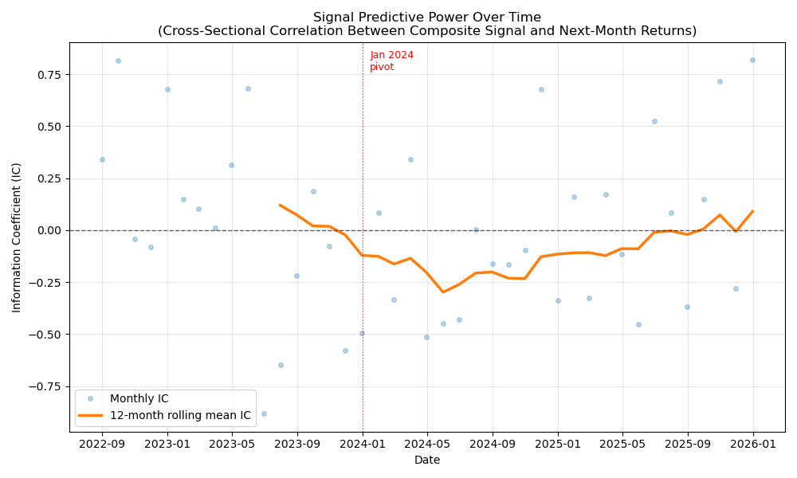

# UK Consumer Alt-Data Strategy

A systematic long-only equity strategy on UK consumer stocks, using three alternative data sources (Google Trends search volume, UK port freight statistics, and ONS retail sales indices) to generate monthly signals. Personal project.

## At a glance

- **7 UK consumer stocks**, monthly rebalancing, long-only top-3
- **Three alternative data sources**: Google Trends search interest, DfT port freight statistics, and ONS retail sales indices
- **42-month backtest** with 20bp monthly transaction cost
- **Result**: Sharpe 0.08 (net) vs 0.21 for equal-weight benchmark. Strategy underperformed, but per-signal IC diagnostic reveals a regime shift in early 2024 - full analysis below.

## Hypothesis

Consumer stock returns should be predictable, in part, from three publicly observable inputs:

1. **Consumer attention** - if search interest in a brand is unusually high vs its recent history, this may lead its share price.
2. **UK import activity** - if UK inbound container tonnage is unusually high, this may signal broader consumer demand strength.
3. **Retail sales momentum** - if a stock's category (food, clothing, household) shows unusually strong YoY sales growth, that momentum may persist into next-month returns.

The strategy tests whether combining these signals into a composite score, and holding the top-ranked stocks monthly, beats a naive equal-weight benchmark.

## Universe

Seven FTSE-listed UK consumer stocks, chosen for meaningful UK brand recognition and mix of sub-sector exposure:

| Ticker | Company | Sub-sector | ONS category |
|---|---|---|---|
| GRG.L | Greggs | Food-to-go | Food stores |
| NXT.L | Next | Apparel & home | Clothing |
| JD.L | JD Sports | Sportswear | Clothing |
| DOM.L | Domino's Pizza UK | Restaurant delivery | Food stores |
| JDW.L | JD Wetherspoon | Pubs | Food stores |
| BME.L | B&M European | Discount retail | Household goods |
| MKS.L | Marks & Spencer | Food & clothing | Food stores |

## Data sources

- **Prices:** yfinance, 5 years of daily data, resampled to month-end.
- **Google Trends:** manually exported CSVs (trends.google.com) covering the past five years, UK region, brand-name search terms. Data is monthly frequency due to Google's default aggregation for multi-year queries.
- **UK port freight:** DfT PORT0502 quarterly statistics (gov.uk open data). Inbound tonnage across five container-heavy UK ports (Felixstowe, London, Southampton, Grimsby & Immingham, Liverpool), forward-filled to monthly frequency to reflect the ~10 week publication lag.
- **ONS retail sales:** UK Office for National Statistics Retail Sales Index (dataset ID: DRSI), automated download via ONS API. Chained volume year-on-year percentage change, seasonally adjusted, at category level (food, clothing, household). Each stock is mapped to the category most relevant to its business. Data is lagged by 1 month to reflect ONS's publication schedule and avoid lookahead bias.

## Method

1. Load and clean each data source into `data/processed/`.
2. Combine into a single monthly dataset (`master_dataset.csv`).
3. For each stock, compute a 12-month rolling z-score of Google Trends search interest.
4. Compute a 12-month rolling z-score of UK container port inbound tonnage (macro signal, same for all stocks).
5. For each stock, compute a 12-month rolling z-score of its mapped ONS category YoY growth.
6. Take the equal-weighted average of the three z-scores as the composite score.
7. Each month, hold the top three stocks by composite score, equal-weighted. Rebalance monthly at month-end.
8. Apply a 20bp transaction cost per month as a rough allowance for rebalancing turnover.
9. Compare against an equal-weight buy-and-hold benchmark across the same universe.

## Results

Sample period: August 2022 to January 2026 (42 months after the 12-month burn-in for rolling signals).

| Metric | Strategy (net) | Equal-weight benchmark |
|---|---|---|
| Annualised return | -0.78% | 2.19% |
| Annualised volatility | 23.68% | 24.34% |
| Sharpe ratio | 0.08 | 0.21 |
| Maximum drawdown | -42.4% | -27.4% |
| Hit rate (positive months) | 54.8% | 52.4% |

The strategy underperformed the equal-weight benchmark. It outperformed from inception through January 2024, then lagged persistently. Higher hit rate but worse average outcomes suggests the wins were small and the losses were large.


*Cumulative returns: strategy (solid line) versus equal-weight benchmark (dashed).*

## Interpretation

The signal diagnostic tests each signal individually and as a composite, measuring cross-sectional information coefficient (IC) - the month-by-month correlation between signal ranks and next-month returns across the 7 stocks.

**Port freight is excluded from the per-signal IC analysis.** It is a macro (market-timing) signal - the same value applies to all 7 stocks in any given month, so cross-sectional IC is undefined by construction. It is retained in the composite for its market-timing exposure, but a production system would treat market-timing and stock-selection signals separately rather than combining them.

| Signal | Full-sample IC | Pre-Jan 2024 IC | Post-Jan 2024 IC |
|---|---|---|---|
| Google Trends | -0.001 | +0.015 | -0.013 |
| ONS Retail Sales | -0.033 | +0.026 | -0.074 |
| Composite (3-signal) | -0.031 | **+0.085** | **-0.113** |



*12-month rolling mean IC for each signal. All three lines follow closely correlated trajectories - the signals capture the same underlying consumer momentum theme rather than adding independent information.*

### What the diagnostic shows

The signals were modestly predictive pre-2024 and decisively anti-predictive through 2024-25, with a gradual recovery toward zero in late 2025. All three signals moved together, and the composite amplified both the pre-2024 positive IC and the post-2024 negative IC.

### Why the signal likely broke down

With only 42 observations no explanation can be proved, but the timing is consistent with a change in what actually drove UK consumer stock returns.

Through 2022 and most of 2023, the Bank of England was still hiking (peaking at 5.25% in August 2023) and consumer stocks moved primarily on operational fundamentals - retail sales, footfall, brand momentum. The signals here measure exactly that, and had modest positive predictive power in that period.

From late 2023 the narrative shifted. Cuts were repeatedly deferred as inflation stayed sticky, and consumer stocks became rates-sensitive plays rather than earnings-driven ones. Then in October 2024 the Autumn Budget announced a large increase in employer National Insurance contributions taking effect April 2025, hitting exactly the retailers, pubs and restaurants in this universe on cost structure regardless of top-line demand.

Once the market started pricing consumer stocks on rate expectations and cost inflation rather than on demand strength, signals that measure demand strength lost their edge. A retailer with strong Google Trends and rising ONS food sales could still get sold if its wage bill was about to jump or if a rate cut got pushed back.

### Why the natural fix is not simply "switch signals"

A naive response is to switch to a different signal in January 2024 when the IC turned. This is exactly the wrong lesson. On 31 January 2024 no live investor knew a regime shift had begun - the rolling IC did not cross zero until several months later. Any "switch" designed knowing what happened next is in-sample optimisation: it fits the backtest to the exact history observed and would fail live.

The professional approach is either (a) a multi-signal ensemble with dynamic weighting across many independent signals, or (b) an explicit regime-detection model that predicts the current market driver. Both need far more data and signals than this project has.

The realistic next iteration for this project is a fourth signal that captures the driver the market actually switched to - SONIA futures or gilt yield changes as a rates factor - so the composite has exposure to both demand momentum and rates. That would let the strategy adapt to whichever driver is dominant without fitting to observed regime breaks.

### Two competing readings of the pre-2024 IC of +0.085

- **Favourable:** the signals genuinely captured consumer momentum in a period when that mattered, and the shift to a negative IC reflects the macro drivers described above.
- **Skeptical:** with 17 pre-period months, +0.085 could arise from noise. The recovery in late 2025 could be a re-emergence of signal or continued noise. Distinguishing requires more data.

Both readings are defensible. With 41 total observations, no result should be treated as robust.

## Limitations

- **Sample size.** 42 months is small. Confidence intervals on Sharpe ratio and IC are wide - point estimates should not be treated as precise.
- **Trends frequency.** Google Trends returned monthly data for the multi-year query. Weekly-frequency Trends data (achievable with rolling shorter queries stitched together) would materially increase sample size.
- **Port freight is macro-uniform.** The same value applies to all stocks, so it doesn't help select between them - it only tilts the whole portfolio in or out. Including it in a cross-sectional composite is conceptually imperfect.
- **ONS category mapping is coarse.** Wetherspoons and Domino's are mapped to "food stores" but their businesses (pub food, pizza delivery) are only loosely related to the retail food category ONS tracks.
- **Universe is small and UK-focused.** Extending to a broader FTSE 250 consumer basket would improve statistical power.
- **Transaction costs are a rough approximation.** A production version would model bid-ask spreads, stamp duty, and slippage per trade rather than a flat monthly haircut.
- **Backtest is not live.** No paper trading has been run; results are historical simulation only.

## Extensions

- **Rates factor** (SONIA futures or 2Y gilt yield changes) to add exposure to whichever driver is currently dominant - demand momentum or rates sensitivity
- Weekly Google Trends via rolling shorter queries, stitched together, to increase sample size from 42 to ~180 observations
- Broader universe (FTSE 250 consumer names) for better cross-sectional differentiation
- Long-short version with market-neutral construction
- Multi-signal ensemble with dynamic weighting when signal count is high enough to support it

## How to run

Requirements: Python 3.11+ and the libraries listed in `requirements.txt`.

```bash
pip install -r requirements.txt
python src/pull_prices.py       # pull yfinance price data
python src/load_trends.py       # load manually exported Google Trends CSVs
python src/load_port_data.py    # load DfT port freight ODS file
python src/load_ons_data.py     # download and process ONS retail sales
python src/build_dataset.py     # combine into master monthly dataset
python src/backtest.py          # run backtest, produce equity curve
python src/diagnostic.py        # per-signal IC diagnostic
```

Google Trends CSVs must be manually downloaded from trends.google.com (5-year queries, UK region) and placed in `data/raw/` as `[ticker]_trends.csv`.

DfT port freight ODS must be downloaded from gov.uk (PORT0502 quarterly data) and placed as `data/raw/port0502.ods`.

ONS retail sales data downloads automatically via API on first run.

## Repository structure
```
uk-consumer-alt-data/
├── README.md
├── requirements.txt
├── data/
│   ├── raw/               (source data)
│   └── processed/         (cleaned datasets)
├── src/
│   ├── pull_prices.py
│   ├── load_trends.py
│   ├── load_port_data.py
│   ├── load_ons_data.py
│   ├── build_dataset.py
│   ├── backtest.py
│   └── diagnostic.py
└── outputs/
    ├── equity_curve.png
    ├── signal_diagnostic.png
    └── strategy_returns.csv
```

## Disclaimer

This project is for educational purposes and personal skill development. It is not investment advice. Past performance in any backtest does not indicate future returns.